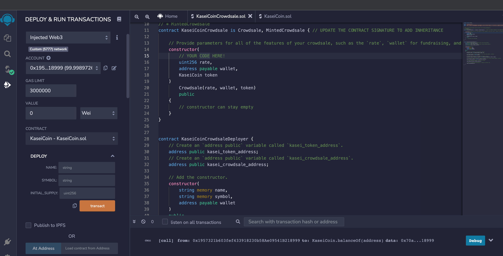
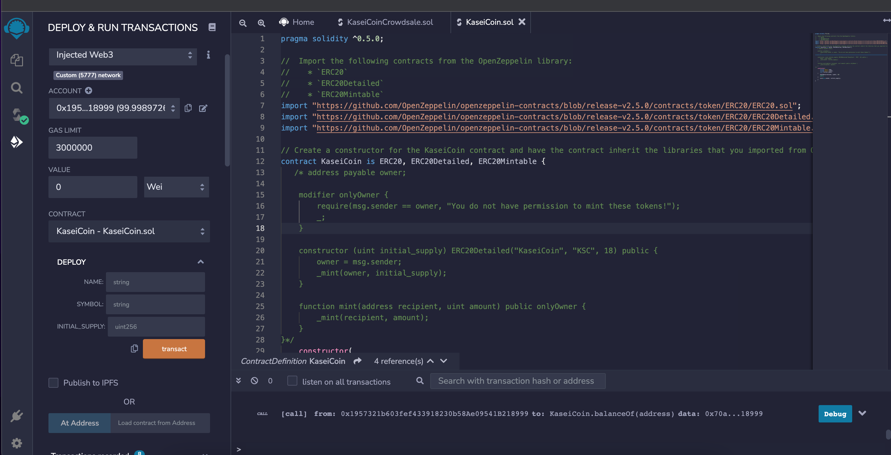
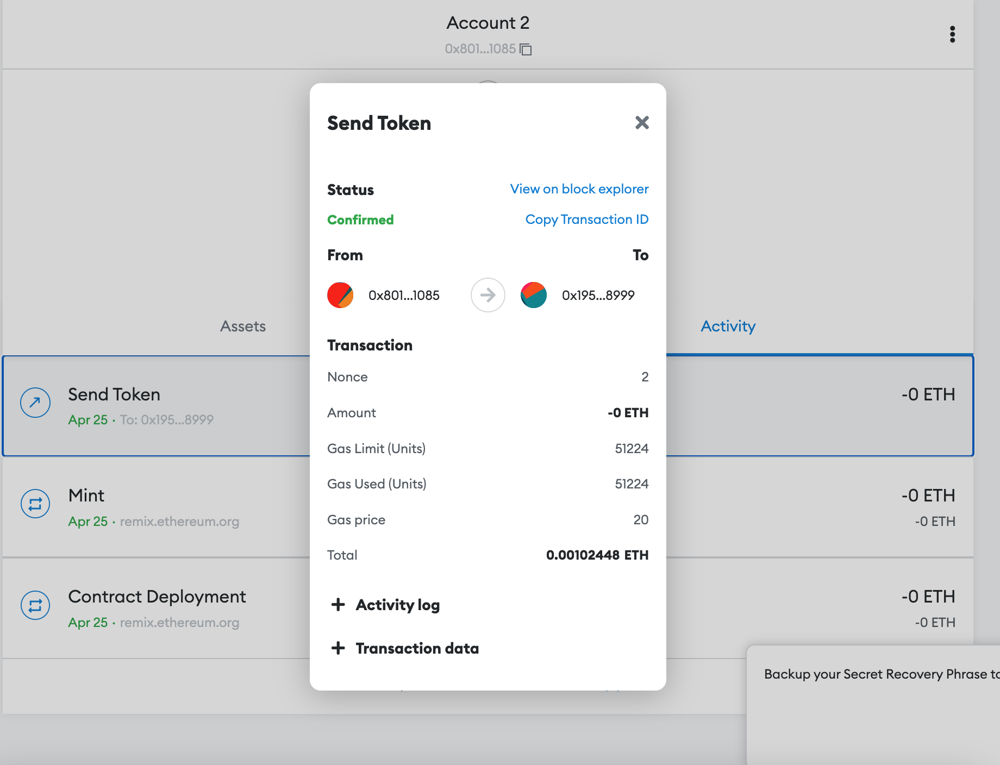
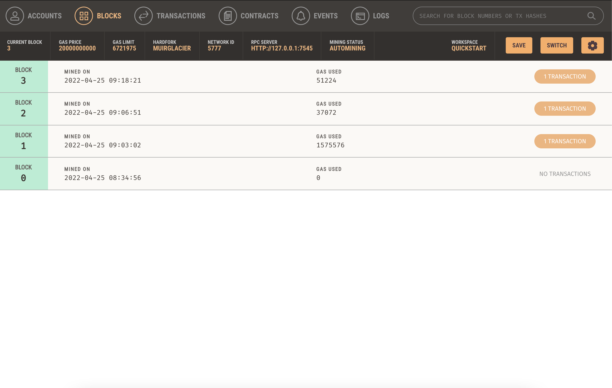
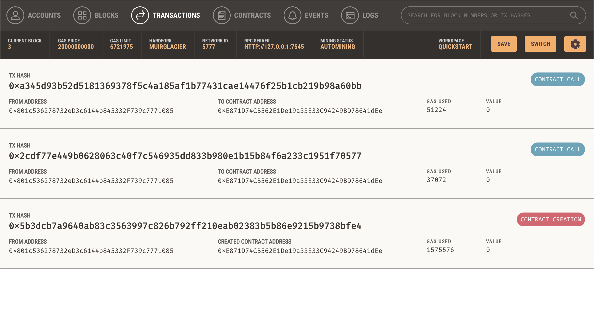
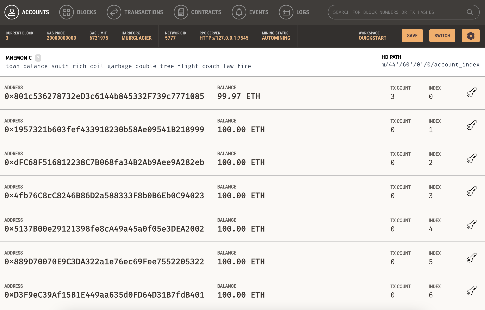

# Unit 21: Martian Token Crowdsale

## Background

After waiting for years and passing several tests, the Martian Aerospace Agency is the first human colony on Mars. To develop a monetary system for the new Mars colony. This is a system on blockchain technology and to define a new cryptocurrency named **KaseiCoin**. (Kasei means Mars in Japanese.)

KaseiCoin will be a fungible token that’s ERC-20 compliant. This is a crowdsale that will allow people who are moving to Mars to convert their earthling money to KaseiCoin.

## Instructions

The steps for this assignment are divided into the following subsections:

1. Create the KaseiCoin Token Contract

2. Create the KaseiCoin Crowdsale Contract

3. Create the KaseiCoin Deployer Contract

4. Deploy and Test the Crowdsale on a Local Blockchain

In the `README.md` file of your GitHub repository for this homework assignment, you’ll create a section named Evaluation Evidence. In this section, you’ll share screenshots of your work from each subsection of the assignment.

---

## Submission

* Upload the files for this assignment to your GitHub repository.

* Submit the link to your GitHub repo on Bootcamp Spot.

---

© 2021 Trilogy Education Services, a 2U, Inc. brand. All Rights Reserved.
